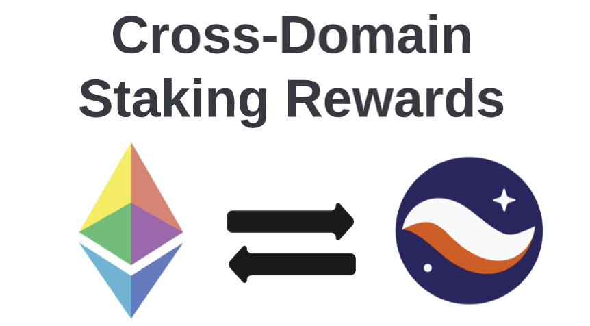
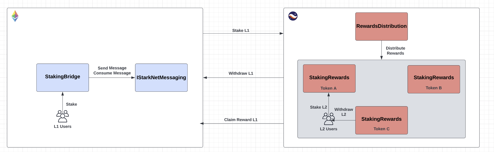

# StarkNet Staking Rewards Template

# 

**WARNING: This repo hasn't been audited and still isn't fully covered with tests.**

## Overview

This repo is inspired on [Synthetix's Staking Rewards contract](https://github.com/Synthetixio/synthetix/blob/develop/contracts/StakingRewards.sol) but designed for StarkNet and with extra features to introduce a Cross-Domain rewards earning mechanism. Multiple StakingRewards instances may be deployed and users can stake in order to earn reward tokens either directly in StarkNet, or without having to bridge liquidity to L2 by using the `StakingBridge` L1 contract. Using this design, developers are able to onboard L1 users and liquidity to L2 with less barriers compared to allowing only L2 tokens to be used in the system.

## Architecture

# 

## Contracts

**L1**

- `StakingBridge` Communicates with StarknetMessaging and handles L1 users interactions

**L2**

- `StakingRewards` Allows depositing the registered staking token in order to earn reward tokens at a certain rate
- `RewardsDistribution` Handles allocation of reward tokens in the StakingRewards deployed instances

### Contracts L1 <> L2 flow

### Staking

Developers are able to deploy multiple StakingRewards contracts in order to support a variety of staking tokens and incentivize users staking with an allocation of reward tokens. Staking tokens that a project may want to list can potentially be in a state where they still don't have a deployed contract in StarkNet yet, or users that own a lot of liquidity in some specific token may be more present in L1. The `StakingRewards` contract aims to solve this problem by allowing not only the regular way of staking tokens in the same domain, but also introduces the ability through the `StakingBridge` to directly stake tokens from L1, even if those don't have an L2 version yet, and claim rewards with much lower gas fees due to StarkNet's scalability potential.

This way, StakingRewards has two entrypoints:

- `stakeL1` L1 handler that receives a message from the StakingBridge which keeps tokens in L1
- `stakeL2` Standard stake function which transfers tokens from the caller's address

However, note that L1 users and L2 users flows are separated through the `stakeL1`, `stakeL2`, `withdrawL1` and `withdrawL2` functions in order to ensure full compatibility, although the system does not enforce or gives any benefit to different types of users.

### Claiming rewards

Both claim reward functions, `claimRewardL1` and `claimRewardL2`, can be used by both L1 and L2 users. Differently from stake and withdraw functions, rewards claiming function have been slightly redesigned from Syntehtix's model in away that both users supported by the application can claim the rewards directly to the preferred domain using any arbitrary recipient. This solves the potential issue of a user having different wallet addresses in L1 and L2 using different formats.

When rewards claimed to L1, L2 tokens are burnt and minted by the StakingBridge contract. Hence the ERC20 reward token must be mintable and allow the StakingBridge to mint new tokens in L1.

### Rewards Distribution

The `RewardsDistribution`contract handles the creation of new `Distribution` structs and only requires **one** deployed instance. Each `Distribution` contains the destination address and the amount of reward tokens being sent, so the `RewardsDistribution_authority` address is able to prepare multiple distributions for all staking rewards pools and dispatch all of them in one single `distributeRewards` call. Rewards distribution are expected to be ran by the authority address and admin operations are executed by the contract's `Ownable` owner.

## Installation and execution

### Requirements

- [Node.js](https://github.com/nvm-sh/nvm)
- [Python](https://docs.python.org/3/using/index.html)
- [Cairo and StarkNet environment](https://starknet.io/docs/quickstart.html)
- [Yarn](https://yarnpkg.com/)
- [Protostar](https://docs.swmansion.com/protostar/docs/tutorials/installation)

### Environment

**Install Node dependencies**

Let's install all our project dependencies:

```bash
yarn install
```

### Build L1 Contracts

Hardhat is used for compiling and testing L1 contracts:

```bash
yarn compile:l1
```

### Build L2 Contracts

StarkNet contracts can be compiled either by using the `starknet-hardhat-plugin` or `protostar`:

```bash
yarn compile:l2
```

```bash
protostar build
```

### Start testnets

We recommend to run L1 and L2 testnets in different terminals.

### Run tests

L1 contracts use a StarkNet Core mock to simulate sending and consuming messages and at the moment are tested using hardhat.

Run L1 tests:

```bash
yarn test:l1
```

L2 contracts are tested using [Protostar](https://docs.swmansion.com/protostar/docs/tutorials/testing), which allows writing Cairo test files and are present inside the `test/l2/**` directory.

Run L2 tests:

```bash
yarn test:l2
```

And in order to run all tests:

```bash
yarn test
```

Contributions are welcome by picking any open issue or simply creating a new one, this repo is still under improvements and is open to any suggestions/feature requests.

References:
[Immutable StarkNet contracts](https://github.com/immutable/imx-starknet)
[Synthetix](https://github.com/Synthetixio/synthetix)
[AAVE StarkNet Bridge](https://github.com/aave-starknet-project/aave-starknet-bridge)
[StarkNet DAI Bridge](https://github.com/makerdao/starknet-dai-bridge)
